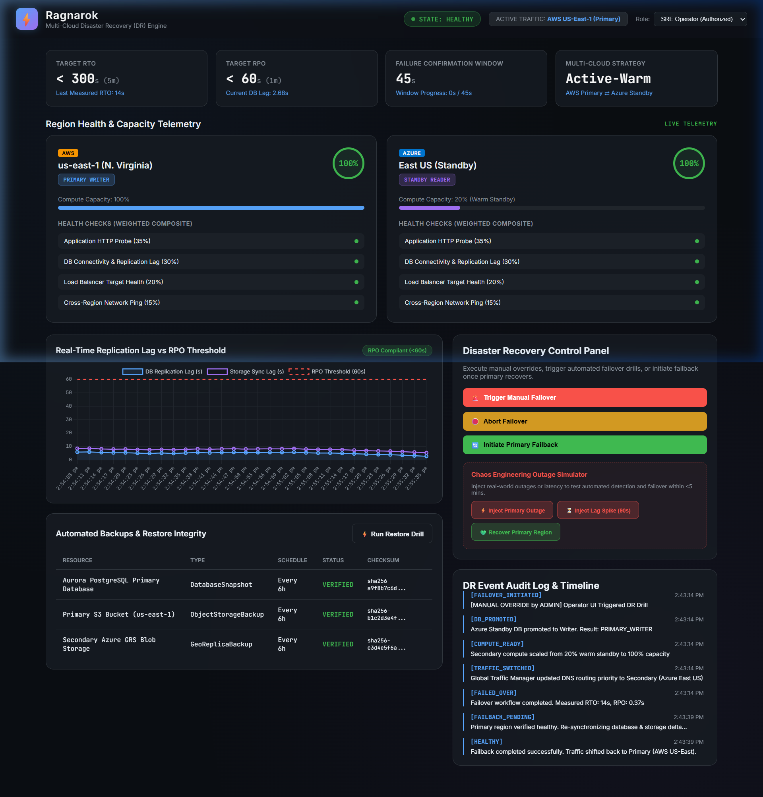

# Ragnarok - Dashboard User Guide & Component Explanation

This document provides a comprehensive explanation of every section, gauge, metric, button, and indicator on the **Ragnarok Multi-Cloud Disaster Recovery Control Dashboard**.

---

## 1. 🔝 Navigation Header Bar

The header bar provides persistent, high-level system visibility and authorization controls across all DR operations.

- **⚡ Brand Logo & Version**: Displays system identity (`Ragnarok v1.0.0`) and active module status.
- **FSM State Badge (`STATE: HEALTHY`)**: Real-time status indicator for the **Failover Finite State Machine (FSM)**.
  - 🟢 **`HEALTHY`**: Primary region is fully operational and serving live traffic.
  - 🟡 **`MONITORING`**: Primary region health is degraded; system is tracking the 45-second failure confirmation window.
  - 🔴 **`FAILOVER_INITIATED` / `DB_PROMOTED` / `TRAFFIC_SWITCHED` / `FAILED_OVER`**: Failover sequence is actively executing or completed.
- **Active Traffic Badge (`ACTIVE TRAFFIC: AWS US-East-1`)**: Identifies which cloud region is currently receiving live production traffic from the Global Traffic Manager.
- **Role Selector (`Role: SRE Operator / System Admin / Guest Viewer`)**: Controls Role-Based Access Control (RBAC). Elevated roles (`SRE_OPERATOR` or `ADMIN`) are required to execute manual DR overrides or failback operations.

---

## 2. 📊 Top KPI Metric Cards

Four stat cards display critical SLA targets, live telemetry metrics, and deployment architecture rules.

1. **Target RTO Card (`< 300s (5m)`)**:
   - **Purpose**: Displays the target **Recovery Time Objective** (SLA < 5 minutes).
   - **Sub-Metric**: Shows the **last measured RTO duration** from the most recent failover execution (e.g., `14s`).
2. **Target RPO Card (`< 60s (1m)`)**:
   - **Purpose**: Displays the target **Recovery Point Objective** (maximum allowable data loss < 60 seconds).
   - **Sub-Metric**: Tracks real-time primary-to-secondary database replication lag in seconds (e.g., `2.68s`).
3. **Failure Confirmation Window Card (`45s`)**:
   - **Purpose**: Tracks the sustained duration required before a degraded primary region transitions to `DOWN` and triggers automated failover.
   - **Sub-Metric**: Displays progress counter (`Window Progress: 0s / 45s`).
4. **Multi-Cloud Strategy Card (`Active-Warm`)**:
   - **Purpose**: Outlines the architectural deployment model (AWS Primary ⇄ Azure Warm Standby).

---

## 3. 🌐 Region Health & Capacity Telemetry Panel

Side-by-side comparative telemetry cards for **Primary (AWS)** and **Secondary (Azure)** regions.

### AWS Primary Region Card (`us-east-1 N. Virginia`)
- **Role Pill (`PRIMARY WRITER`)**: Confirms this database cluster is accepting production write transactions.
- **Health Score Circle (`100%`)**: Composite score derived from 4 weighted health signals.
- **Compute Capacity Bar (`100%`)**: Shows full active compute footprint.
- **Weighted Composite Probes**:
  1. *Application HTTP Probe (35% weight)*: Synthetic transaction probe (fails after 3 consecutive errors).
  2. *DB Connectivity & Replication Lag (30% weight)*: Evaluates DB reachability and lag (< 60s).
  3. *Load Balancer Target Health (20% weight)*: Monitors healthy target ratio (> 50% required).
  4. *Cross-Region Network Ping (15% weight)*: Tests inter-cloud VPN reachability.

### Azure Secondary Region Card (`East US Standby`)
- **Role Pill (`STANDBY READER`)**: Confirms secondary DB is operating as a read replica (switches to `PRIMARY WRITER (Promoted)` upon failover).
- **Health Score Circle (`100%`)**: Live composite health score of the secondary region.
- **Compute Capacity Bar (`20% Warm Standby`)**: Standby compute runs at a reduced cost-efficient footprint, automatically scaling to **100%** upon failover.

---

## 4. 📈 Real-Time Replication Lag vs RPO Threshold Chart

A live time-series chart rendering real-time replication telemetry:
- **Blue Solid Line (`DB Replication Lag`)**: Database log shipping / CDC lag in seconds (~1.2s baseline).
- **Purple Solid Line (`Storage Sync Lag`)**: S3 Cross-Region Replication to Azure Blob GRS sync lag (~4.5s baseline).
- **Red Dashed Line (`RPO Threshold - 60s`)**: Fixed SLA threshold boundary.
- **RPO Compliance Badge**:
  - 🟢 **`RPO Compliant (<60s)`**: Normal operation within SLA limits.
  - 🔴 **`⚠️ RPO BREACH EXCEEDED`**: Flashes red if replication lag exceeds 60 seconds.

---

## 5. 💾 Automated Backups & Restore Integrity Table

Displays protected storage assets and automated backup verification records.

- **Resource Columns**: Lists `Aurora PostgreSQL Primary Database`, `Primary S3 Bucket`, and `Secondary Azure GRS Blob Storage`.
- **Status (`VERIFIED`)**: Confirms backup snapshot integrity and retention policy compliance (30 days).
- **Checksum Hash**: SHA-256 cryptographic hash verifying snapshot authenticity.
- **⚡ Run Restore Drill Button**: Triggers `/api/v1/backups/restore-test` to restore snapshots in an isolated sandbox and verify table record checksums.

---

## 6. 🚨 Disaster Recovery Control Panel (Manual Overrides)

Role-gated controls allowing SRE operators to manage disaster recovery workflows manually:

- **🚨 Trigger Manual Failover Button**: Initiates immediate failover drill, promoting Azure DB to writer, scaling compute to 100%, and updating global DNS routing.
- **🛑 Abort Failover Button**: Aborts an in-progress failover prior to DNS cutover if primary health recovers.
- **🔄 Initiate Primary Failback Button**: Executes controlled failback routine, re-synchronizing data deltas and returning active traffic to AWS.

---

## 7. ⚡ Chaos Engineering Outage Simulator

Interactive buttons to test automated detection and recovery in real-time:

- **⚡ Inject Primary Outage**: Simulates a total power/network outage in AWS `us-east-1`, dropping health to 0% and triggering the 45s automated failover confirmation window.
- **⏳ Inject Lag Spike (90s)**: Simulates network congestion pushing replication lag to 90s (testing RPO breach alerting).
- **💚 Recover Primary Region**: Clears active chaos injections and restores primary region health back to 100%.

---

## 8. 📜 DR Event Audit Log & Timeline

Chronological log recording every state transition (`HEALTHY` ➔ `MONITORING` ➔ `FAILOVER_INITIATED` ➔ `DB_PROMOTED` ➔ `COMPUTE_READY` ➔ `TRAFFIC_SWITCHED` ➔ `FAILED_OVER`), exact timestamps, trigger reasons, and measured RTO/RPO stats for compliance auditing.
